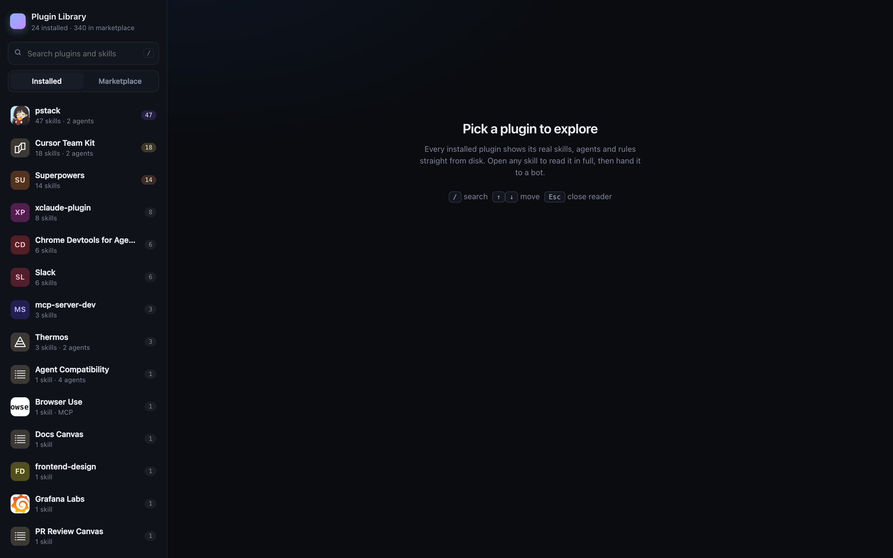
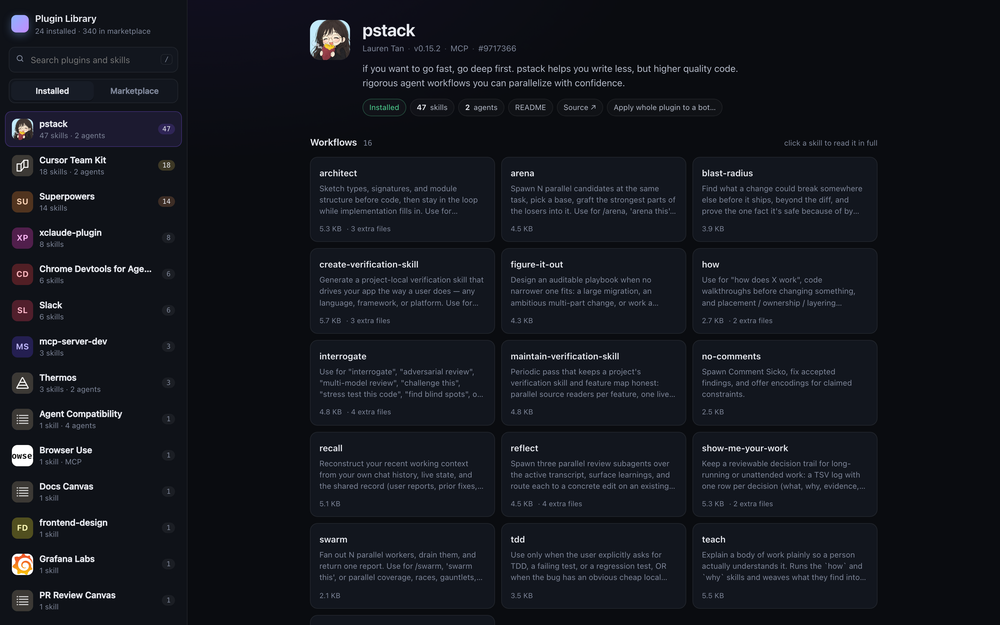
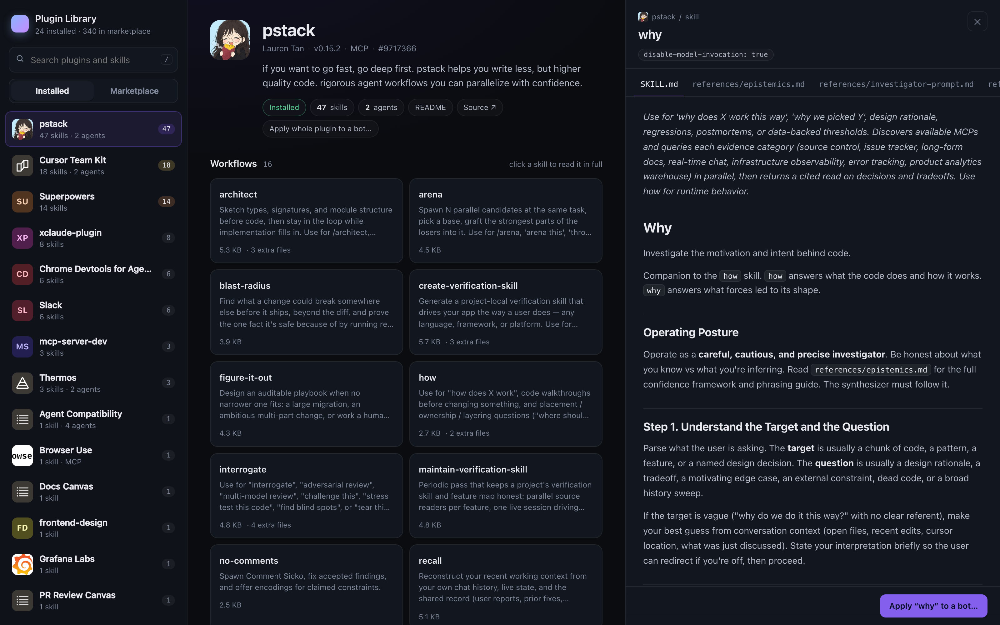
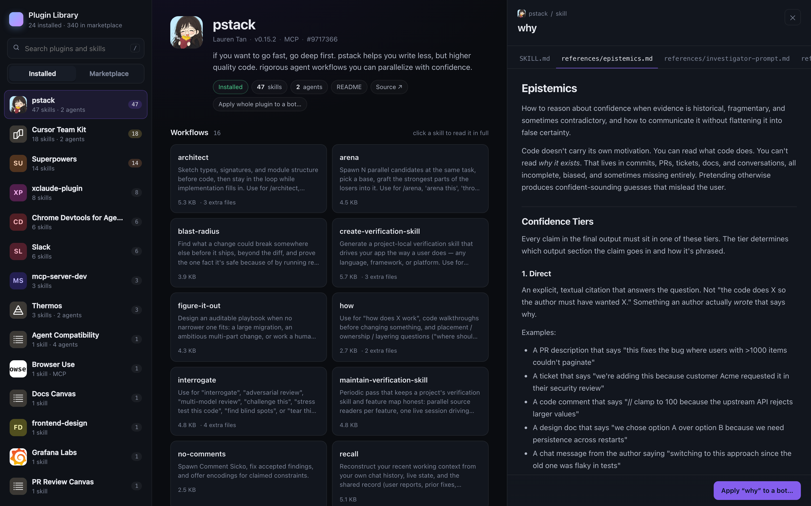
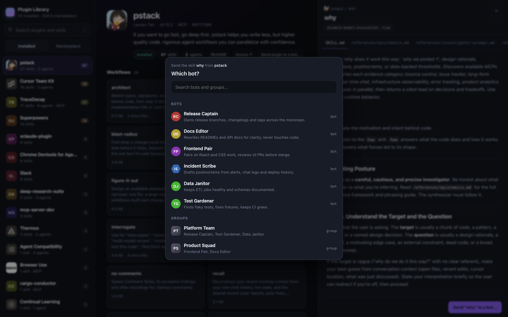
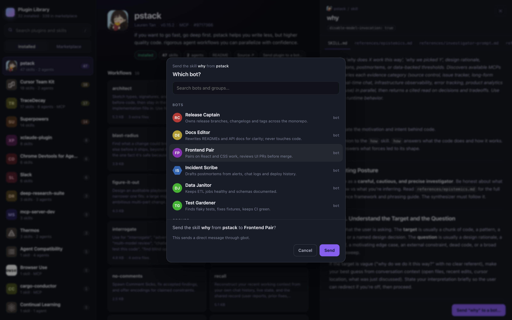
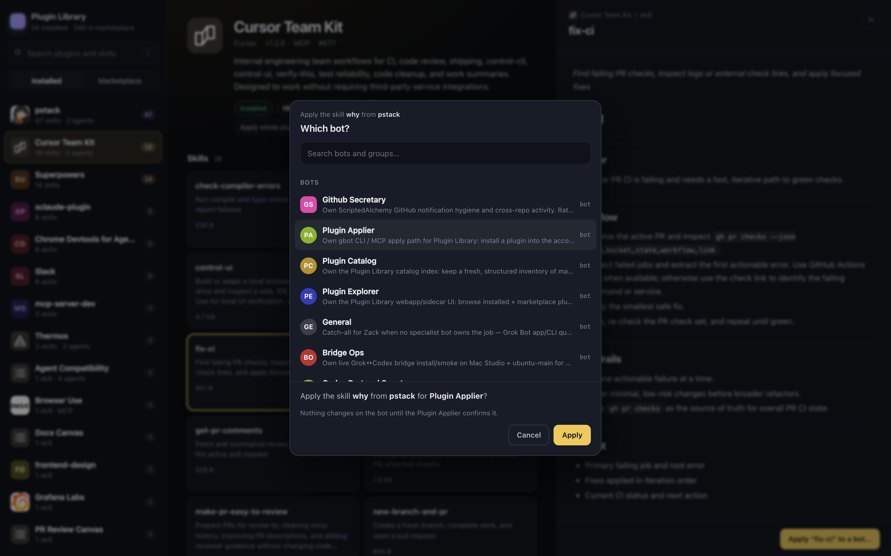
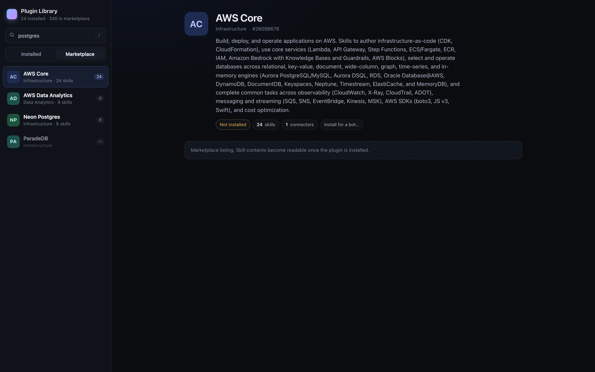

# Plugin Library

A local explorer for your agent plugins. Three panes: the plugins on this machine and in the marketplace → a plugin's skills, agents and rules → the full `SKILL.md` rendered in a reading pane, straight from disk. "Send to a bot" picks a target from the live [`gbot`](https://github.com/ScriptedAlchemy/grok-bot-cli) roster and asks before anything is sent.

Ships as a Cursor / Grok Bot plugin: `/plugin-library` starts the server and opens it.

## Tour

Installed plugins, sorted by how much they ship. Search covers plugin names, descriptions and skill ids.



pstack's 47 skills, grouped the way the Catalog suggests (Workflows, Bot+style, Principles, Language), with agents and rules below.



Click a skill and the full `SKILL.md` opens in the reading pane. Front matter becomes chips, sibling reference files become tabs, and relative links between them switch tabs instead of leaving the page. `#/p/9717366/s/why` is a shareable deep link.





"Send to a bot" pulls the live roster from `gbot` (bots and groups) and ends in one sentence you confirm. Nothing is sent until you click Send.





Every installed plugin gets the same treatment, not only pstack.



Marketplace listings show catalog copy and can be sent to a bot too.



## Run from a checkout

Node 22.19+. The explorer reads `~/.cursor/plugins/cache` and `~/.cursor/plugins/local`; the bot picker needs `gbot` on `PATH` (without it the explorer still works and the picker says the roster is unavailable).

```bash
git clone https://github.com/ScriptedAlchemy/plugin-library.git
cd plugin-library
npm start                      # http://127.0.0.1:8787/
```

Or let the launcher manage the process:

```bash
node bin/plugin-library.mjs open [query] [--json] [--browser]   # start if needed, print or open a deep link
node bin/plugin-library.mjs status --json
node bin/plugin-library.mjs stop
```

`open pstack` resolves to `#/p/9717366`; `open why` to the skill inside it. `open` is idempotent: it reuses a running server or starts one detached (pid in `logs/server.pid`, output in `logs/server.out`).

Default port **8787** (`PORT`). Binds `127.0.0.1` because it shells out to `gbot` and serves cache files without auth; set `HOST=0.0.0.0` only on a network you trust. `CURSOR_PLUGIN_CACHE`, `CURSOR_PLUGIN_LOCAL` and `GBOT_BIN` override the two plugin directories and the CLI.

## Install as a plugin

The `agent-bundle-artifact` branch is the generated, validated plugin root (built by CI on every push to `main`).

**Cursor, from GitHub.** Dashboard → Plugins → Team Marketplaces → Add Marketplace, import `https://github.com/ScriptedAlchemy/plugin-library`, pick the `agent-bundle-artifact` branch, then install **Plugin Library**. (Team Marketplaces need a Teams or Enterprise plan.)

**Cursor, without a team marketplace.**

```sh
git clone --branch agent-bundle-artifact --depth 1 https://github.com/ScriptedAlchemy/plugin-library.git
cd plugin-library && node ./install.mjs
```

Reload Cursor (`Developer: Reload Window`). `npx --no-install agent-bundle doctor --from . --host cursor` verifies the install.

**Grok Bot.** The same generated root is an Agent Plugins 1.0.0 package: `plugin.json` plus `skills/`. Hand it to the host's plugin flow; the `plugin-library` skill teaches the bot to answer skill questions from the read-only API of an already-running explorer. The `/plugin-library` slash command is Cursor-only.

**From a source checkout**, for a local proof:

```bash
npm ci && npm run build
node artifact/install.mjs
```

In the installed plugin the launcher lives at `scripts/plugin-library.mjs` (the command file uses `${CURSOR_PLUGIN_ROOT}/scripts/plugin-library.mjs`); in this repo it is `bin/plugin-library.mjs`.

Then in an agent session:

- `/plugin-library` opens the explorer (embedded browser when the session has one, OS browser otherwise).
- `/plugin-library pstack` or `/plugin-library why` deep-links to that plugin or skill.

Agents never call `POST /api/send`; the bundled command and skill both say so. Sending to a bot is a click you make.

## API

| Route | Returns |
|-------|---------|
| `GET /api/library` | `{ installed, marketplace, groups }`. *Installed* means present in this machine's plugin cache or local plugin directory; catalog rows supply copy, category and ids. Plugins with no catalog row get `local:<name>`-style ids. |
| `GET /api/local/<marketplace>/<slug>/doc/<path>` | `{ meta, markdown }` for any `.md`/`.mdc` inside that plugin |
| `GET /api/local/<marketplace>/<slug>/file/<path>` | any other file inside that plugin (logos, scripts). Symlinks and `..` that leave the plugin root are 404 |
| `GET /api/bots` | live bots + groups from `gbot bots list` / `gbot groups list` (20s cache; `?refresh=1` bypasses) |
| `POST /api/send` | `{ plugin_id, bot_ref, skill_id? }`, same-origin JSON only. Verifies the plugin, skill and target, then runs `gbot send <target> <message>`. Used by the UI after you confirm. |

## Data

`data/unified-catalog.json` is a snapshot of the Cursor marketplace (names, descriptions, categories, ids); `data/pstack.json` is the Catalog's suggested grouping for pstack's skills. Both are read server-side only and copied into the built plugin. Everything else (skills, agents, rules, logos) is read live from disk. When a plugin is cached twice (numeric id and slug), the copy Cursor marked `<hash>.installed` wins, then the highest version.

## Develop

```bash
npm ci
npm run check        # agent-bundle validate, tsc, build, node --test, artifact validate, packed-install smoke
```

Screenshots in `screens/` are 1600×1000 @2x from a headless-Chrome tour with a stub `gbot` roster.
